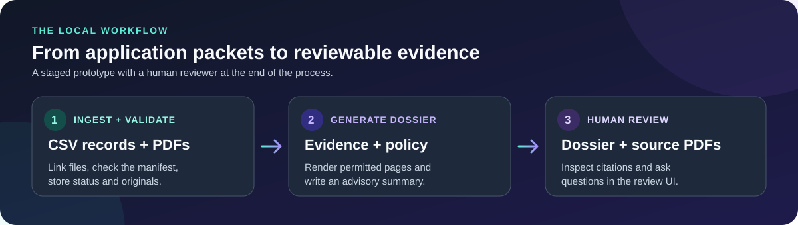
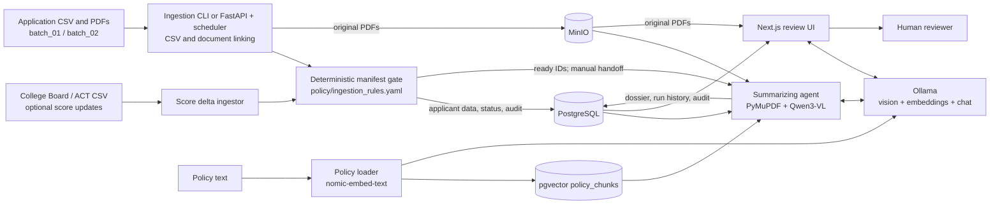

<h1 align="center">AI-Assisted College Admissions System Prototype</h1>

<p align="center"><strong>Turn application packets into evidence-backed dossiers for human review.</strong><br/>A local research prototype built with Python, PostgreSQL, MinIO, Ollama, and Next.js.</p>

<p align="center">
  <a href="#what-it-does">Overview</a> ·
  <a href="#system-architecture">Architecture</a> ·
  <a href="#run-the-sample-workflow">Run the demo</a> ·
  <a href="#test-the-system">Testing</a> ·
  <a href="#detailed-documentation">Documentation</a>
</p>



## What it does

The system accepts applicant CSV records and PDFs, checks packet completeness, and prepares advisory dossiers that reviewers can inspect alongside original documents. Ingestion and dossier generation are separate stages, with an explicit handoff of applicants ready for review.

| 1 · Intake | 2 · Dossier | 3 · Review |
| --- | --- | --- |
| Link applicant records and PDFs, check required materials, and record status and audit events. | Use permitted pages and retrieved policy text to draft sections with supporting evidence. | Read the saved dossier, open source PDFs, and ask questions grounded in the dossier. |

> [!NOTE]
> The included applicants and documents are synthetic. This prototype **does not make or record final admissions decisions**.

**New here?** Follow the [sample workflow](#run-the-sample-workflow) to ingest `batch_02`, generate a dossier for `APP_012`, and open the review UI. The seven steps cover every required service and dependency.

## System architecture



1. **Ingestion** reads the batch CSV, upserts applicant fields, links PDFs by applicant ID, and archives raw files in MinIO. It checks size, PDF signature, and the required document manifest without extracting PDF content. Unmatched documents are recorded as orphans.
2. **The manifest gate** applies [`policy/ingestion_rules.yaml`](policy/ingestion_rules.yaml). It routes complete packets to `READY_FOR_REVIEW`, missing documents to `AWAITING_MATERIALS`, missing required fields to `INCOMPLETE`, and integrity failures to `ERROR`. It writes an audit report and a JSON file of ready IDs. An optional score-feed CLI updates SAT/ACT/AP fields and re-runs the gate.
3. **Dossier generation** is invoked separately for a ready applicant. It downloads permitted PDFs, renders pages with PyMuPDF, retrieves policy chunks from PostgreSQL/pgvector, and asks Ollama's `qwen3-vl:8b-instruct` model for academic, engagement, recommendation, supplement, policy, and holistic sections. It records evidence and validation results, then stores successful dossiers and run history in PostgreSQL. The agent's document rules withhold personal statements from model input for human review.
4. **The review UI** reads saved dossiers from PostgreSQL, serves original PDFs from MinIO, and sends questions about the selected dossier to Ollama. It is a local, read-only prototype without authentication or a final-decision workflow.

PostgreSQL is the shared record for status, document metadata, dossiers, and audit/run history. MinIO holds original PDFs. The policy loader reads [`policy/riverview_admissions_policy.txt`](policy/riverview_admissions_policy.txt), which is separate from the YAML used by the ingestion gate. The older [architecture overview](docs/architecture/system_overview.md) describes a broader plan, including components not wired into this runnable workflow.

### Where data lives

| Stored artifact | Purpose |
| --- | --- |
| PostgreSQL `applicants` and `audit_logs` | Applicant fields, document metadata, current workflow status, and ingestion audit events |
| PostgreSQL `policy_chunks` | Searchable policy text and embeddings for dossier generation |
| PostgreSQL `applicant_dossier`, `dossier_generation_runs`, and `summary_audit_log` | Advisory output, its validation/run history, and agent audit events |
| MinIO `admissions-raw-docs` bucket | Original applicant PDFs, including documents reserved for human review |

The separate [`ingestion/parsing/`](ingestion/parsing/) and [`ai_agent/gateway/`](ai_agent/gateway/) modules represent earlier parsing/model interfaces; the two-pass ingestion runner does not call them, and the current dossier agent implements its own PDF/model path. The supplied [high school profiles](data/high_school_profiles/) are also not incorporated into the current agent's prompts.

### Repository map

| Component | Responsibility | Code and data |
| --- | --- | --- |
| Batch and score ingestion | Stage CSV fields, link PDFs, archive originals, process optional SAT/ACT updates | [`ingestion/`](ingestion/), [batch CLI](ingestion/run_ingestion_check.py), [score CLI](ingestion/run_score_ingest.py) |
| Manifest validation | Apply required-field, document, file-size, and PDF-signature rules; route packets by status | [`ingestion/validation/`](ingestion/validation/), [`policy/ingestion_rules.yaml`](policy/ingestion_rules.yaml) |
| Storage | Keep applicant records, statuses, audit entries, document metadata, and raw PDFs | [`storage/`](storage/), PostgreSQL, MinIO |
| Policy retrieval and dossier agent | Index policy text, render permitted PDF pages, retrieve relevant policy chunks, generate and validate advisory sections | [`ai_agent/`](ai_agent/), Ollama, pgvector |
| Review UI | Show saved dossiers and PDFs, and answer questions using dossier context | [`ui/`](ui/) |
| Data | Synthetic batches, applicant records, and school profiles | [`data/`](data/), including [`batch_01/`](data/batches/batch_01/) and [`batch_02/`](data/batches/batch_02/) |
| Policy | Hold the agent policy text and the ingestion checklist, file limits, and routing rules | [`policy/`](policy/) |
| Tests | Keep automated tests and review reproduction scripts | [`tests/`](tests/) |
| Documentation | Explain the API, architecture, agent, and review UI | [`docs/`](docs/) |
| Run output | Keep ingestion reports, ready-ID files, dossier snapshots, and test evidence | [`output/`](output/) |

## Review interface

The browser places a saved dossier beside the original PDFs and provides a question-and-answer area below them. The preview shows a synthetic applicant; the walkthrough below uses `APP_012`.


## Run the sample workflow

These instructions start from a repository checkout on macOS or Linux and use only the synthetic sample data. Run commands from the repository root unless a step says otherwise. Windows users can follow the same stages with the [PowerShell equivalents below](#windows-powershell) and consult the [recorded Windows live test](output/live_test_setup/README.md) for additional verification; that older record contains machine-specific paths.

### 1. Install prerequisites

- [Docker with Compose](https://docs.docker.com/compose/install/) for the local PostgreSQL/pgvector and MinIO services.
- Python 3.10 or newer and Node.js 20.9 or newer with npm.
- [Ollama](https://ollama.com/download) for the local vision and embedding models. Model download and inference require substantial disk space and memory; a full dossier can take several minutes.
- A **MinIO AIStor license file**. The [official container setup](https://docs.min.io/aistor/installation/container/install/) explains how to obtain a free-tier license. Save it outside the repository and note its absolute path. The local MinIO container cannot accept S3 uploads without a working license.

Check that `docker compose version`, `python3 --version`, `node --version`, `npm --version`, and `ollama --version` work before continuing.

### 2. Start the data services

```bash
cp .env.example .env
```

In `.env`, set `MINIO_LICENSE_FILE` to the **absolute path** of your downloaded license, for example `/Users/you/minio/minio.license`. The remaining example values match the local [`compose.yaml`](compose.yaml): PostgreSQL on `127.0.0.1:5432`, MinIO S3 on `127.0.0.1:9000`, and the MinIO console on `127.0.0.1:9001`. The local credentials are for this synthetic demo only.

```bash
docker compose config --quiet
docker compose up -d
docker compose ps
docker compose exec -T postgres pg_isready -U postgres -d riverview_admissions
curl -f http://127.0.0.1:9000/minio/health/live
```

Expect PostgreSQL to report that it accepts connections and the MinIO health request to succeed. A health response alone does not prove S3 uploads work; the strict ingestion run in step 5 checks the real storage path. Compose retains data in named volumes when the containers stop.

### 3. Install Python and UI dependencies

```bash
python3 -m venv .venv
source .venv/bin/activate
python -m pip install -r requirements.txt
cd ui
npm ci
cp .env.local.example .env.local
cd ..
```

Both example environment files use the same PostgreSQL database and `admissions-raw-docs` bucket. If you use different services, update the root `.env` and `ui/.env.local` consistently; if you change credentials or ports in the provided Compose stack, update `compose.yaml` too. Ingestion reads `DATABASE_URL`; the agent, policy loader, and UI read `POSTGRES_*`. The root example's `LLM_MODEL` is for the older generic gateway; `VLM_MODEL` controls the dossier agent.

The Python CLIs need environment variables exported into their shell. After activating the virtual environment, run this in each new terminal used for backend commands:

```bash
set -a
. ./.env
set +a
```

### 4. Start Ollama and fetch the models

Start the Ollama desktop app, or run `ollama serve` in a separate terminal if it is not already running. Then:

```bash
ollama pull qwen3-vl:8b-instruct
ollama pull nomic-embed-text
ollama list
curl -f http://127.0.0.1:11434/api/tags
```

The policy loader uses `nomic-embed-text`; the dossier agent and UI chat use `qwen3-vl:8b-instruct`.

### 5. Ingest the sample batch

```bash
mkdir -p output/local_demo
python -m ingestion.run_ingestion_check --input-dir data/batches/batch_02 \
  --require-postgresql --require-object-storage \
  --output output/local_demo/batch_02_report.txt \
  --affected-ids output/local_demo/affected_ids.json
cat output/local_demo/affected_ids.json
```

The strict flags require real PostgreSQL and MinIO. Expect 10 applicants processed: 7 `READY_FOR_REVIEW`, 1 `AWAITING_MATERIALS`, and 2 `INCOMPLETE` for the supplied fixture. Confirm `APP_012` is in the affected-ID JSON file. The report explains each packet's routing. This file is the manual handoff to dossier generation; ingestion makes no model calls. Rerunning the command replaces these two local demo artifacts.

For a lightweight gate check without services, `./ingestion/run_check.sh data/batches/batch_01` or `make check` can use SQLite and simulated object storage. That mode **cannot feed a live dossier/UI run**.

### 6. Index policies and generate one dossier

```bash
python ai_agent/create_pgvector_once.py
python ai_agent/summarizing_agent.py APP_012
```

The loader creates the `vector` extension and builds or replaces `policy_chunks` from [the agent policy text](policy/riverview_admissions_policy.txt). Run it once for a new database or after that text changes. The PostgreSQL user must be allowed to create extensions. Pass an applicant ID explicitly: the agent's no-argument fallback does **not** read the unique ingestion handoff. `--force` deliberately regenerates an existing dossier.

A successful run prints `DOSSIER_READY`, stores a row in `applicant_dossier`, records a `dossier_generation_runs` entry, and writes a snapshot under `output/ai_agent/`. Check the **new database run and status**, not only the CLI exit code or an older snapshot: the current agent can catch an applicant-level error and still exit with code 0. The bundled PostgreSQL container supplies `psql` for this check:

```bash
docker compose exec -T postgres psql -U postgres -d riverview_admissions \
  -c "SELECT app_id, status FROM applicants WHERE app_id = 'APP_012';"
docker compose exec -T postgres psql -U postgres -d riverview_admissions \
  -c "SELECT app_id, run_status, validation->>'passed' AS passed, created_at FROM dossier_generation_runs WHERE app_id = 'APP_012' ORDER BY created_at DESC LIMIT 1;"
```

Expect `DOSSIER_READY` for the applicant and newest generation run, with validation passed. Compare citations with original PDFs; validation does not prove every model-written claim correct.

### 7. Open the review UI

In a second terminal, from the repository root:

```bash
cd ui
npm run dev
```

Open <http://localhost:3000>, select `APP_012`, inspect its dossier, use **View Full** on a PDF, and ask: “What is this applicant's unweighted GPA, and which evidence supports it?” The sample answer should identify **3.97** with supporting evidence; check the answer against the dossier and original PDF. The selector lists only applicants with saved dossiers. Keep `.env` and `.env.local` out of Git.

Stop the UI with **Ctrl+C**. Stop the two data services with `docker compose stop`; their named volumes retain the demo database and PDFs. Use `docker compose up -d` to resume.

### Windows PowerShell

Use the same `compose.yaml`, Ollama commands, and UI URL. At step 2, use `Copy-Item .env.example .env`, then set `MINIO_LICENSE_FILE` in `.env` to your own absolute path using forward slashes, such as `C:/Users/you/minio/minio.license`. The `docker compose` commands work in PowerShell too. At step 3, replace the Unix Python setup and environment-loading commands with:

```powershell
python -m venv .venv
.\.venv\Scripts\python.exe -m pip install -r requirements.txt
Get-Content .env | ForEach-Object {
    if ($_ -match '^([A-Za-z_][A-Za-z0-9_]*)=(.*)$') {
        [Environment]::SetEnvironmentVariable($matches[1], $matches[2], 'Process')
    }
}
New-Item -ItemType Directory -Force output/local_demo | Out-Null
```

Run the Python commands from steps 5–6 with `.\.venv\Scripts\python.exe` in place of `python`, and use a single line or PowerShell backticks in place of Bash `\` continuations. Use `Get-Content output/local_demo/affected_ids.json` in place of `cat`. In `ui`, `npm ci` and `npm run dev` work as written; copy `.env.local.example` to `.env.local` with `Copy-Item`.

## Other ways to run ingestion

The CLI above is the simplest route through the sample. The FastAPI service exposes the same ingestion and gate logic and starts an APScheduler job when the service starts. After loading the root `.env`, run:

```bash
uvicorn ingestion.app:app --host 127.0.0.1 --port 8000
```

In another terminal:

```bash
curl http://127.0.0.1:8000/health
curl -X POST http://127.0.0.1:8000/ingestion/batch/trigger
```

The service uses `data/batches/batch_01` unless `INGESTION_INPUT_DIR` is set before startup. Browse <http://127.0.0.1:8000/docs> for the interactive API and see the [API guide](docs/api/ingestion_api.md) for all endpoints. The scheduler follows the host's timezone. The API also stops at the ready-ID handoff; invoke the dossier agent separately.

For an optional score-feed CSV, run `python -m ingestion.run_score_ingest --source college_board --file PATH_TO_CSV` or `--source act`. See `python -m ingestion.run_score_ingest --help` for strict storage flags and the [score ingestion code](ingestion/score_ingest.py) for accepted columns. The feed updates applicant records and re-runs the gate; the current dossier agent does not reliably include changed scores in model prompts.

## Test the system

Run Python tests in the activated virtual environment. Run UI checks from `ui/`. Live checks require the services and ingested `APP_012` from the walkthrough.

| Check | Command or action | What it covers |
| --- | --- | --- |
| Ingestion and storage tests | `python -m pytest tests --ignore=tests/integration_review_20261009 -q` | Batch routing, status persistence, schema, score delta, and API entry points. |
| Focused gate tests | `python -m pytest tests/test_ingestion_and_gate.py -q` | Manifest rules, batch linking, and hard stop without live model calls. |
| Live agent extraction | `python tests/ai_agent/test_academic_only.py` | Reads ingested `APP_012` files from PostgreSQL/MinIO and calls Qwen; does not save a dossier. |
| UI static checks | `cd ui && npm run lint && npm run build` | Lint, TypeScript, and production build. Use `npm run build -- --webpack` if Turbopack cannot start its worker in a restricted environment. |
| End-to-end smoke check | Run steps 2–7, then inspect `APP_012` in the browser | Real storage handoff, a new dossier record, PDF retrieval, and one chat response. |

The [agent testing guide](docs/ai_agent/TESTING_GUIDE.md) has expected outputs and additional negative cases. On this checkout (October 9, 2026), `.venv/bin/python -m pytest tests --ignore=tests/integration_review_20261009 -q` produced **53 passed, 8 failed**; failures include database schema constraints and a GPA precision check. The new Compose stack completed strict Batch 02 ingestion with the expected **7 ready / 1 awaiting / 2 incomplete** results, and the policy loader stored **21 chunks**. UI lint and `npm run build -- --webpack` passed. A full Qwen dossier was not rerun in this check because the vision model was absent locally; the earlier [live Batch 02 test](output/live_test_setup/TEST_RESULTS.md) records an `APP_012` dossier run and UI responses. The [integration review](output/integration_review_20261009/REVIEW.md) describes broader diagnostic failures that remain open.

## Troubleshooting

| Symptom | Check |
| --- | --- |
| `docker compose config` complains about `MINIO_LICENSE_FILE` | Set it in the root `.env` to an existing absolute path. MinIO AIStor needs a valid license for S3 operations. |
| Ingestion reports PostgreSQL or MinIO unavailable | Run `docker compose ps`; confirm ports 5432 and 9000 are free and the root `.env` matches the services. Keep both strict flags for a real handoff. |
| Policy loader cannot connect or create `vector` | Check the `POSTGRES_*` values, database permissions, and that the database uses the pgvector image from `compose.yaml`. |
| No applicants appear in the UI | Generate a successful dossier first; the dropdown queries `applicant_dossier`, not all ingested applicants. |
| PDFs fail to open in the UI | Match `MINIO_ENDPOINT`, credentials, and `MINIO_BUCKET` in `ui/.env.local` to the ingestion configuration; use **View Full** to check the actual PDF route. |
| Agent or chat cannot reach Ollama | Confirm `ollama list` contains both models and `curl http://127.0.0.1:11434/api/tags` succeeds. |
| `npm run build` fails because Turbopack cannot bind a worker port | Run `npm run build -- --webpack` from `ui/`. The build also needs network access for its configured Google fonts. |

## Current scope and known limitations

- This is a research prototype for synthetic data. The review UI has no authentication or final-decision recording; do not deploy it for real applicant records.
- The ingestion-to-agent handoff is manual. Use explicit applicant IDs. Some supplied ready applicants have known agent rendering failures, and a failed run may not surface clearly in the UI.
- Document-type mapping, late score-feed visibility, citation/fact validation, and privacy/chat guardrails have open issues documented in the [integration review](output/integration_review_20261009/REVIEW.md). Human verification of evidence and original documents remains necessary.
- The ingestion YAML and the agent's policy text are separate sources with known differences. Align policy interpretations before using results as policy-compliance evidence.

## Detailed documentation

- [Ingestion API and scheduler](docs/api/ingestion_api.md)
- [Summarizing agent architecture and testing](docs/ai_agent/SYSTEM_OVERVIEW.md), [testing guide](docs/ai_agent/TESTING_GUIDE.md)
- [Review UI setup and behavior](ui/README.md)
- [PostgreSQL schema](docs/data_dictionary/database_schemas.md) and [MinIO object layout](docs/data_dictionary/object_storage_minio.md)
- [Integration review and known defects](output/integration_review_20261009/REVIEW.md)
