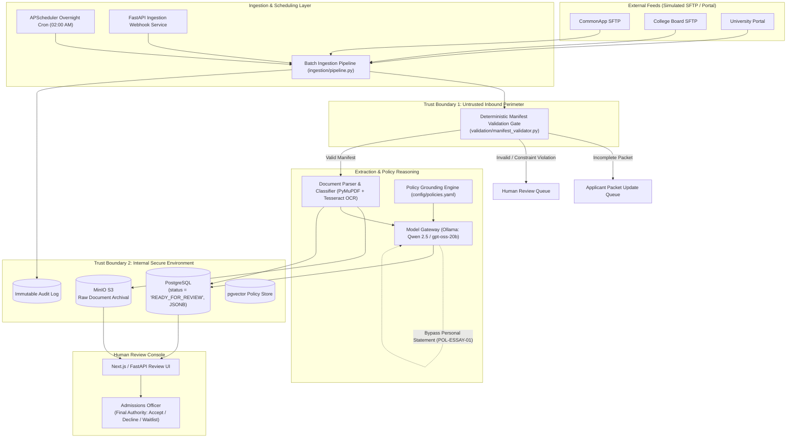

# Riverview State University - Admissions Processing Architecture

[](https://www.python.org/downloads/)
[](https://fastapi.tiangolo.com)
[](https://www.postgresql.org/)
[](https://min.io/)
[](docs_architecture_section_4.md)

An asynchronous, policy-grounded batch evaluation and dossier compilation pipeline for undergraduate admissions applications at Riverview State University (RSU). 

Built in alignment with [Section 4 Architecture Plan](docs_architecture_section_4.md) and institutional admissions policies defined in [policy/policies.yaml](policy/policies.yaml).

---

## Architecture Overview

The system processes inbound applicant packets through an automated, deterministic pipeline that validates submission completeness, extracts text via native PDF parsing and OCR fallback, generates advisory reviews using a containerized local LLM, and presents pre-compiled candidate dossiers to authorized human admissions officers.



---

## Key Components

| Component | Directory | Description |
| :--- | :--- | :--- |
| **Ingestion Layer** | [`ingestion/`](ingestion/) | FastAPI web service and APScheduler configuration for scheduled overnight batch execution. |
| **Validation Gate** | [`validation/`](validation/) | Deterministic manifest validation enforcing Trust Boundary 1 perimeter checks and checklist completeness. |
| **OCR & Parsing** | [`parsing/`](parsing/) | PyMuPDF text extraction with Tesseract OCR fallback for scanned materials; returns structured JSON. |
| **Model Gateway** | [`gateway/`](gateway/) | Local Ollama LLM integration (Qwen 2.5 / gpt-oss-20b) with policy grounding and **mandatory essay evaluation bypass**. |
| **Storage Layer** | [`storage/`](storage/) | PostgreSQL models with `status='READY_FOR_REVIEW'`, JSONB fields, immutable audit logs, and MinIO S3 client. |
| **Configuration** | [`config/`](config/) | `policies.yaml` defining document limits, required checklists, status priority, and operational rules. |

---

## Trust Boundaries & Safety Guarantees

### Trust Boundary 1: Untrusted Inbound Perimeter
Separates external SFTP feeds from internal ingestion services:
* **MIME Sniffing & Extension Enforcement**: Only `.pdf`, `.png`, `.jpg`, `.jpeg`, and `.tiff` allowed.
* **File Size Quotas**: 15 MB per individual file ceiling; 50 MB per packet maximum; 1 KB minimum.
* **Manifest Checklist Gate**: Checks required documents per applicant category (`first_year`, `transfer`, `international`).
* **Deterministic Routing**: Incomplete submissions are routed to **Applicant Packet Update**; corrupt or mismatched packets route to **Human Review**.

### Trust Boundary 2: Internal Secure Environment
Encloses PostgreSQL, MinIO, and internal processing:
* **Student PII Isolation**: Raw files and personal data isolated behind role-based access controls.
* **Immutable Audit Trail**: All pipeline state transitions recorded to the `AuditLog` table.
* **POL-ESSAY-01 Algorithmic Bias Safeguard**:
  > Personal statements and essays are **strictly bypassed** and stripped from LLM prompts and embeddings. Only human admissions officers read and evaluate personal statements in the review console.
* **POL-HUMAN-01 Human Admissions Authority**:
  > The system outputs advisory findings only with default status `READY_FOR_REVIEW`. Automated final admissions decisions (Accept, Decline, Waitlist) are strictly prohibited.

---

## Ingestion & Completeness Check (Batch Ingestion)

This stage performs batch linking and deterministic manifest validation against Trust Boundary 1. It explicitly halts after the completeness check without performing OCR or image rendering, leaving raw application payloads ready for the downstream multimodal Summarizing Agent.

### Run Instructions

Clone/checkout the branch and execute:

```bash
git checkout danny/architecture-plan
git pull origin danny/architecture-plan

# Option 1: One-click script
./run_check.sh batch_01

# Option 2: Using Make
make check

# Option 3: Direct Python CLI
python3 run_ingestion_check.py --input-dir batch_01
```

---

## Quickstart & Local Setup

### 1. Prerequisites
* Python 3.10+
* Docker & Docker Desktop (for PostgreSQL, MinIO, and Ollama)

### 2. Environment Setup
```bash
# Clone and enter the repository
cd MSA8770-Fall2026

# Create and activate virtual environment
python3 -m venv .venv
source .venv/bin/activate

# Install dependencies
pip install -r requirements.txt
```

### 3. Running the Batch Ingestion Pipeline
To run a batch ingestion pass over local synthetic applicant packets:
```bash
python3 -c "
from ingestion import BatchIngestionPipeline
pipeline = BatchIngestionPipeline()
summary = pipeline.run_batch(max_packets=5)
print('Batch Run Summary:', summary)
"
```

### 4. Starting the FastAPI Ingestion Service
```bash
uvicorn ingestion.app:app --host 0.0.0.0 --port 8000 --reload
```
Interactive API documentation will be available at:
* Swagger UI: [http://localhost:8000/docs](http://localhost:8000/docs)
* Health Check: [http://localhost:8000/health](http://localhost:8000/health)

---

## Detailed Documentation Directory

Comprehensive architectural specifications and contracts are located in the [`docs/`](docs/) directory:

* **Architecture & System Overview**: [`docs/architecture/system_overview.md`](docs/architecture/system_overview.md)
* **API Specifications**:
  * [Ingestion Webhook & Scheduling API](docs/api/ingestion_api.md)
  * [Model Gateway & Policy Grounding API](docs/api/gateway_api.md)
* **Data Dictionaries & Schemas**:
  * [PostgreSQL Schemas, JSONB & pgvector Specifications](docs/data_dictionary/database_schemas.md)
  * [MinIO Object Storage & Bucket Hierarchy](docs/data_dictionary/object_storage_minio.md)
* **Human-in-the-Loop Review Console**:
  * [Next.js Review Console UI/UX & RBAC Specifications](docs/review_console/ui_ux_specifications.md)
