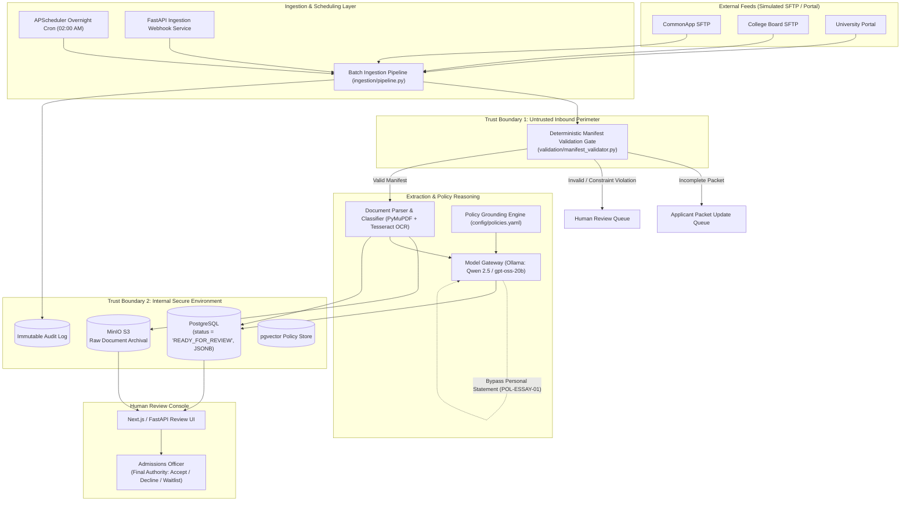

# Riverview State University - Admissions Processing Architecture

[](https://www.python.org/downloads/)
[](https://fastapi.tiangolo.com)
[](https://www.postgresql.org/)
[](https://min.io/)
[](docs_architecture_section_4.md)

An asynchronous, policy-grounded batch evaluation and dossier compilation pipeline for undergraduate admissions applications at Riverview State University (RSU). 

Built in alignment with [Section 4 Architecture Plan](docs_architecture_section_4.md) and institutional admissions policies defined in [policy/policies.yaml](policy/policies.yaml).

---

## Architecture Overview

The system processes inbound applicant packets through an automated, deterministic pipeline that validates submission completeness, extracts text via native PDF parsing and OCR fallback, generates advisory reviews using a containerized local LLM, and presents pre-compiled candidate dossiers to authorized human admissions officers.



---

## Key Components

| Component | Directory | Description |
| :--- | :--- | :--- |
| **Ingestion Layer** | [`ingestion/`](ingestion/) | FastAPI web service and APScheduler configuration for scheduled overnight batch execution. |
| **Validation Gate** | [`validation/`](validation/) | Deterministic manifest validation enforcing Trust Boundary 1 perimeter checks and checklist completeness. |
| **OCR & Parsing** | [`parsing/`](parsing/) | PyMuPDF text extraction with Tesseract OCR fallback for scanned materials; returns structured JSON. |
| **Model Gateway** | [`gateway/`](gateway/) | Local Ollama LLM integration (Qwen 2.5 / gpt-oss-20b) with policy grounding and **mandatory essay evaluation bypass**. |
| **Storage Layer** | [`storage/`](storage/) | PostgreSQL models with `status='READY_FOR_REVIEW'`, JSONB fields, immutable audit logs, and MinIO S3 client. |
| **Configuration** | [`config/`](config/) | `policies.yaml` defining document limits, required checklists, status priority, and operational rules. |

---

## Trust Boundaries & Safety Guarantees

### Trust Boundary 1: Untrusted Inbound Perimeter
Separates external SFTP feeds from internal ingestion services:
* **MIME Sniffing & Extension Enforcement**: Only `.pdf`, `.png`, `.jpg`, `.jpeg`, and `.tiff` allowed.
* **File Size Quotas**: 15 MB per individual file ceiling; 50 MB per packet maximum; 1 KB minimum.
* **Manifest Checklist Gate**: Checks required documents per applicant category (`first_year`, `transfer`, `international`).
* **Deterministic Routing**: Incomplete submissions are routed to **Applicant Packet Update**; corrupt or mismatched packets route to **Human Review**.

### Trust Boundary 2: Internal Secure Environment
Encloses PostgreSQL, MinIO, and internal processing:
* **Student PII Isolation**: Raw files and personal data isolated behind role-based access controls.
* **Immutable Audit Trail**: All pipeline state transitions recorded to the `AuditLog` table.
* **POL-ESSAY-01 Algorithmic Bias Safeguard**:
  > Personal statements and essays are **strictly bypassed** and stripped from LLM prompts and embeddings. Only human admissions officers read and evaluate personal statements in the review console.
* **POL-HUMAN-01 Human Admissions Authority**:
  > The system outputs advisory findings only with default status `READY_FOR_REVIEW`. Automated final admissions decisions (Accept, Decline, Waitlist) are strictly prohibited.

---

## Ingestion & Completeness Check (Batch Ingestion)

This stage implements Component 2 (Two-Pass Ingestion Layer) and Component 3 (Deterministic Manifest Validation Gate) in compliance with Architecture Section 4 and Trust Boundary 1. It halts after manifest validation without performing OCR or image rendering. Each successful run writes a separate affected-ID artifact for the downstream Summarizing Agent.

### Architecture & Two-Pass Design

```
+-----------------------------------------------------------------------------------------+
|                                    BATCH DIRECTORY                                      |
|   +-----------------------+     +--------------------+     +------------------------+   |
|   |  applicant_data.csv   |     | APP_001/ ... APP_N |     | Orphan documents (LOR) |   |
|   +-----------+-----------+     +---------+----------+     +-----------+------------+   |
+---------------|---------------------------|----------------------------|----------------+
                |                           |                            |
       [Pass 1: Flat File CSV]              |                            |
                v                           |                            |
+-------------------------------+           |                            |
| 33-Column Relational Mapping  |           |                            |
| + JSONB Array Staging         |           |                            |
| (activities, awards, APs,     |           |                            |
|  hooks, existing documents)   |           |                            |
+---------------+---------------+           |                            |
                |                           |                            |
                v                           |                            |
+-------------------------------+           |                            |
|  PostgreSQL: applicants table |           |                            |
+---------------+---------------+           |                            |
                |                           |                            |
                +-------------------> [Pass 2: Document Traversal] <-----+
                                            |
                         +------------------+------------------+
                         v                                     v
             [Matched Applicant ID]                   [Orphan Document]
                         |                                     |
         +---------------+---------------+             +-------+-------+
         | Upload to MinIO:              |             | Upload to     |
         | s3://admissions-raw-docs/     |             | MinIO:        |
         |      {app_id}/{filename}      |             | s3://.../     |
         | Attach metadata to documents  |             | orphans/      |
         | JSONB array                   |             | Save to       |
         +---------------+---------------+             | OrphanDocument|
                         |                             | table         |
                         v                             +---------------+
         +---------------+---------------+
         | Component 3: Manifest Gate    |
         | 3-Way Deterministic Routing   |
         | (Enforce 2 LORs, TB1 hygiene) |
         +---------------+---------------+
                         |
           +-------------+-------------+
           v                           v
     [READY_FOR_REVIEW]  [AWAITING_MATERIALS / INCOMPLETE / ERROR]
           |                           |
           v                           v
+----------------------+   +-----------------------+
| Save to              |   | Route to Applicant    |
| affected_ids_<run>.json|  | Packet Update or      |
| & update PostgreSQL  |   | Human Review queue    |
+----------+-----------+   +-----------------------+
           |
           v
+----------------------+
| HARD STOP            |
| Halted prior to LLM  |
| Summarizing Agent    |
+----------------------+
```

1. **Pass 1 (CSV Flat File Parsing & Relational Staging)**:
   - Extracts CSV values into typed relational attributes, including `app_id` (PK), names, `date_of_birth` (`DATE`), contact and school fields, `unweighted_gpa` and `weighted_gpa` (`NUMERIC(5,3)`), `rank`, scores, and admission term/year.
   - Restricts JSONB exclusively to variable-length array payloads:
     - `activities`: List of up to 10 extracurricular activities.
     - `awards`: List of up to 5 honors/awards.
     - `ap_test_scores`: List of up to 12 advanced courses and scores.
     - `hooks`: List of up to 5 institutional consideration flags (e.g. First-Gen, URM).
     - `documents`: Initialized as `[]` for new applicants; retained for existing applicants.
   - Upserts records in PostgreSQL (`applicants` table). New records start as `PENDING`; repeated CSV rows retain prior documents and score-feed data until the merged packet is re-evaluated.

2. **Pass 2 (Document Traversal, Perimeter Hygiene & MinIO Archival)**:
   - Scans subdirectories and root files across the batch.
   - Enforces lightweight **Trust Boundary 1** perimeter hygiene:
     - File existence and size constraint check (1 KB to 15 MB).
     - Standard PDF magic bytes verification (first 5 bytes `b"%PDF-"`) without opening or scanning text.
     - Streaming SHA-256 checksum computation.
   - **Matched Submissions**: Raw PDFs uploaded to MinIO bucket `admissions-raw-docs` under `{app_id}/{filename}`, with metadata attached to the applicant's `documents` JSONB array. Repeated files replace metadata at the same object key, and late files join documents from prior batches.
   - **Orphan Submissions**: Unmatched files (e.g. late LORs without an existing application row) uploaded to MinIO under `orphans/{sha256}/{relative_path}` and recorded in the dedicated `OrphanDocument` PostgreSQL table.

3. **Component 3 (Deterministic Manifest Validation Gate)**:
   - Evaluates applicant packet against institutional policy rules (`config/policies.yaml`):
     - Required CSV fields are `App_ID`, `First_Name`, `Last_Name`, `Date_Of_Birth`, and `Email_Address`; other applicant metadata is optional for completeness.
     - **`VALID`** -> Status updated to `READY_FOR_REVIEW` (all mandatory fields, transcript, application form, personal statement, and **2 letters of recommendation** present).
     - **`AWAITING_MATERIALS`** -> Required documents are missing; routed to **Applicant Packet Update**.
     - **`INCOMPLETE`** -> Required metadata fields are missing; routed to **Applicant Packet Update**. If both fields and documents are missing, `INCOMPLETE` takes priority and the report lists both.
     - **`ERROR`** -> Status `ERROR` (corrupted files, magic byte mismatches, or size violations -> routed to **Human Review**).
   - Each applicant's final gate result appends a `MANIFEST_EVALUATED` row to PostgreSQL `audit_logs` in the same transaction as the status update. Its JSON details include a run ID, status, missing field and document names, error count, and document count; raw applicant metadata is excluded.

4. **Affected-ID Output & Hard Stop**:
   - The IDs of applicants reaching `READY_FOR_REVIEW` in the run are exported to a unique `affected_ids_<run>.json` file and printed to stdout. The API also returns the exact file path.
   - Execution halts with clean exit code `0` immediately after report generation, ensuring downstream LLM/VLM summarizers are only triggered on demand.

### Storage & Resilience Fallback
- Connection parameters are read from environment variables (`DATABASE_URL`, `MINIO_ENDPOINT`, `MINIO_BUCKET`, `MINIO_ACCESS_KEY`, `MINIO_SECRET_KEY`).
- If PostgreSQL or MinIO services are offline during local prototyping, the `StorageManager` logs clear warnings and automatically engages dry-run simulation mode, permitting full local manifest generation and test execution while performing real inserts/uploads whenever services are live.
- For a production summary-agent handoff, run the CLI with `--require-postgresql --require-object-storage`. The API and overnight scheduler require both by default and verify that every ready applicant's linked document exists in MinIO.

### Run Instructions

From the repository root, execute:

```bash
# Option 1: One-click script
./run_check.sh batch_01

# Option 2: Using Make
make check

# Option 3: Direct Python CLI
python3 run_ingestion_check.py --input-dir batch_01

# Production handoff with shared storage checks
python3 run_ingestion_check.py --input-dir batch_01 --require-postgresql --require-object-storage
```

---

## Quickstart & Local Setup

### 1. Prerequisites
* Python 3.10+
* Docker & Docker Desktop (for PostgreSQL, MinIO, and Ollama)

### 2. Environment Setup
```bash
# Clone and enter the repository
cd MSA8770-Fall2026

# Create and activate virtual environment
python3 -m venv .venv
source .venv/bin/activate

# Install dependencies
pip install -r requirements.txt
```

### 3. Running the Batch Ingestion Pipeline
To run a batch ingestion pass over local synthetic applicant packets:
```bash
python3 -c "
from ingestion import BatchIngestionPipeline
pipeline = BatchIngestionPipeline()
summary = pipeline.run_batch()
print('Batch Run Summary:', summary)
"
```

### 4. Starting the FastAPI Ingestion Service
```bash
uvicorn ingestion.app:app --host 0.0.0.0 --port 8000 --reload
```
Interactive API documentation will be available at:
* Swagger UI: [http://localhost:8000/docs](http://localhost:8000/docs)
* Health Check: [http://localhost:8000/health](http://localhost:8000/health)

### 5. Delta Test Score Ingestion (College Board & ACT)
Asynchronous and CLI delta ingestors link external SAT/AP and ACT score reports to existing `ApplicationRecord`s in PostgreSQL or in-memory dry-run mode:
```bash
# Ingest College Board SAT subscores and AP courses
python3 run_score_ingest.py --source college_board --file path/to/college_board_scores.csv

# Ingest ACT composite and section scores
python3 run_score_ingest.py --source act --file path/to/act_scores.csv

# Use both checks before handing score changes to the summary agent
python3 run_score_ingest.py --source act --file path/to/act_scores.csv --require-postgresql --require-object-storage
```
* **Matching**: Case-insensitive matching by email with fallback to Date of Birth (`YYYY-MM-DD` or `MM/DD/YYYY`).
* **Deduplication**: Appends AP scores to `ap_test_scores` without duplicating subject/score pairs.
* **Orphan Handling**: Unmatched student score rows are archived in the `OrphanTestScore` table.
* **Manifest Gate Re-triggering**: Automatically re-runs `ManifestValidationGate` on updated applicants. A changed score for a ready applicant, including an `INCOMPLETE` or `AWAITING_MATERIALS` to ready promotion, is written to that score run's unique affected-ID file; an identical replay leaves the new file empty.
* **Handoff**: The score result reports `handoff_ready`. It is true only when both strict storage checks were requested and completed; local dry-run artifacts are for inspection.

---

## Detailed Documentation Directory

Comprehensive architectural specifications and contracts are located in the [`docs/`](docs/) directory:

* **Architecture & System Overview**: [`docs/architecture/system_overview.md`](docs/architecture/system_overview.md)
* **API Specifications**:
  * [Ingestion Webhook & Scheduling API](docs/api/ingestion_api.md)
  * [Model Gateway & Policy Grounding API](docs/api/gateway_api.md)
* **Data Dictionaries & Schemas**:
  * [PostgreSQL Schemas, JSONB & pgvector Specifications](docs/data_dictionary/database_schemas.md)
  * [MinIO Object Storage & Bucket Hierarchy](docs/data_dictionary/object_storage_minio.md)
* **Human-in-the-Loop Review Console**:
  * [Next.js Review Console UI/UX & RBAC Specifications](docs/review_console/ui_ux_specifications.md)
