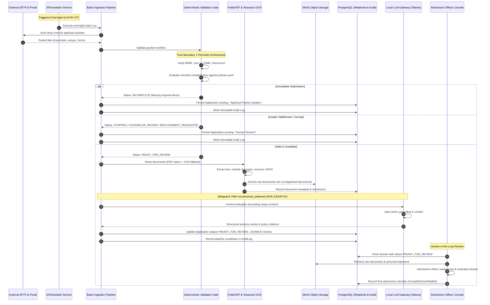
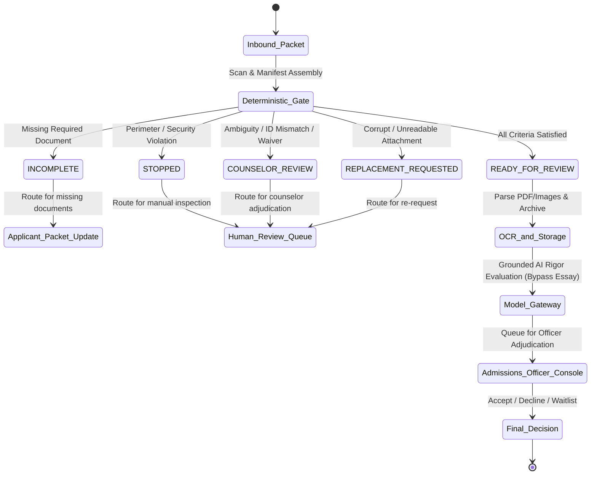

# System Architecture & Technical Specifications

**Document Version**: 1.0  
**Status**: APPROVED  
**Related Reference**: [docs_architecture_section_4.md](../../docs_architecture_section_4.md)

---

## 1. Architectural Philosophy & Objectives

The Riverview State University admissions processing system implements an **asynchronous batch evaluation pipeline** designed around four foundational architectural principles:

1. **Deterministic Perimeter Gates**: All inbound submissions are scrutinized at an untrusted perimeter for MIME validity, file size bounds, and mandatory document completeness before any compute-intensive parsing or AI inference is permitted.
2. **Context-Grounded Rigor Evaluation**: High school academic rigor is evaluated strictly relative to the student's high school profile offerings and four-year AP cap (`POL-AP-01`), avoiding systemic bias against under-resourced schools.
3. **Mandatory Essay Algorithmic Safeguard (`POL-ESSAY-01`)**: Personal statements and essays are stripped by design from automated LLM inference prompts and vector embeddings to prevent algorithmic bias; they are routed directly to authorized human officers.
4. **Human Final Admissions Authority (`POL-HUMAN-01`)**: AI evaluation findings and workflow statuses (`READY_FOR_REVIEW`, `INCOMPLETE`, `COUNSELOR_REVIEW`) are purely advisory. Authorized admissions officers retain exclusive authority to record final decisions (`Accept`, `Decline`, `Waitlist`).

---

## 2. End-to-End Component Lifecycle

---

## 3. Trust Boundary Technical Specifications

### Trust Boundary 1: Untrusted Inbound Perimeter
* **Boundary Purpose**: Separates untrusted external feeds (CommonApp SFTP, College Board SFTP, third-party transcript portal exports) from internal compute infrastructure.
* **Perimeter Controls**:
  * **MIME Sniffing**: Inspects magic bytes and headers; permits only `application/pdf`, `image/png`, `image/jpeg`, and `image/tiff`.
  * **File Size Quotas**: Rejects files larger than 15 MB (`max_file_size_bytes: 15728640`) and packets larger than 50 MB (`max_packet_size_bytes: 52428800`). Rejects zero-byte or corrupt files under 1 KB (`min_file_size_bytes: 1024`).
  * **Path Sanitization**: Rejects paths containing directory traversal patterns (`..`, `/`, `\`).
  * **Checklist Completeness**: Matches submitted document types against institutional checklists in `config/policies.yaml`.
  * **Deterministic Routing Matrix**:
    * If missing required items: Status `INCOMPLETE` $\rightarrow$ Target: **Applicant Packet Update**.
    * If unreadable required items: Status `REPLACEMENT_REQUESTED` $\rightarrow$ Target: **Human Review**.
    * If applicant ID mismatch or ambiguous coursework: Status `COUNSELOR_REVIEW` $\rightarrow$ Target: **Human Review**.
    * If perimeter violation (disallowed MIME/size limit): Status `STOPPED` $\rightarrow$ Target: **Human Review**.

### Trust Boundary 2: Internal Secure Environment
* **Boundary Purpose**: Encloses core data stores, student PII, and internal evaluation services.
* **Security Controls**:
  * **Network Isolation**: PostgreSQL, MinIO, and local Ollama containers run on an isolated Docker network (`backend-net`) without public ingress.
  * **Immutable Audit Trail**: Every ingestion event, OCR run, LLM invocation, and decision change is appended to the `AuditLog` table with UTC timestamp and actor identifier.
  * **Algorithmic Bias Isolation**: The Model Gateway guarantees that student essays never enter LLM prompt buffers or vector embedding indexes.
  * **Presigned Access**: Document binaries stored in MinIO are never directly exposed; frontend clients receive time-limited presigned URLs (TTL: 3600 seconds).

---

## 4. Status Priority & State Transitions

When multiple findings occur within a single packet, the system evaluates status resolution in strict priority order:

$$\text{STOPPED} \succ \text{COUNSELOR\_REVIEW} \succ \text{REPLACEMENT\_REQUESTED} \succ \text{INCOMPLETE} \succ \text{READY\_FOR\_REVIEW}$$

