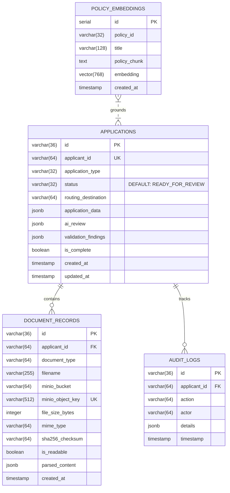

# PostgreSQL & pgvector Database Schemas

**Database Engine**: PostgreSQL 15+ with `pgvector` extension  
**ORM Implementation**: [`storage/models.py`](../../storage/models.py), [`storage/database.py`](../../storage/database.py)

---

## 1. Relational Tables Overview



---

## 2. Complete SQL DDL Definitions

```sql
-- Enable UUID and pgvector extensions
CREATE EXTENSION IF NOT EXISTS "uuid-ossp";
CREATE EXTENSION IF NOT EXISTS "vector";

-- 1. Main Applications Table
CREATE TABLE IF NOT EXISTS applications (
    id VARCHAR(36) PRIMARY KEY DEFAULT uuid_generate_v4()::text,
    applicant_id VARCHAR(64) UNIQUE NOT NULL,
    application_type VARCHAR(32) NOT NULL DEFAULT 'first_year',
    status VARCHAR(32) NOT NULL DEFAULT 'READY_FOR_REVIEW',
    routing_destination VARCHAR(64) NOT NULL DEFAULT 'READY_FOR_REVIEW',
    application_data JSONB NOT NULL DEFAULT '{}'::jsonb,
    ai_review JSONB NOT NULL DEFAULT '{}'::jsonb,
    validation_findings JSONB NOT NULL DEFAULT '[]'::jsonb,
    is_complete BOOLEAN NOT NULL DEFAULT TRUE,
    created_at TIMESTAMP WITH TIME ZONE DEFAULT NOW() NOT NULL,
    updated_at TIMESTAMP WITH TIME ZONE DEFAULT NOW() NOT NULL
);

CREATE INDEX IF NOT EXISTS idx_applications_applicant_id ON applications(applicant_id);
CREATE INDEX IF NOT EXISTS idx_applications_status ON applications(status);
CREATE INDEX IF NOT EXISTS idx_applications_routing ON applications(routing_destination);

-- 2. Document Archival Records Table
CREATE TABLE IF NOT EXISTS document_records (
    id VARCHAR(36) PRIMARY KEY DEFAULT uuid_generate_v4()::text,
    applicant_id VARCHAR(64) NOT NULL,
    document_type VARCHAR(64) NOT NULL,
    filename VARCHAR(255) NOT NULL,
    minio_bucket VARCHAR(64) NOT NULL DEFAULT 'applicant-documents',
    minio_object_key VARCHAR(512) UNIQUE NOT NULL,
    file_size_bytes INTEGER NOT NULL,
    mime_type VARCHAR(64) NOT NULL DEFAULT 'application/pdf',
    sha256_checksum VARCHAR(64),
    is_readable BOOLEAN NOT NULL DEFAULT TRUE,
    parsed_content JSONB NOT NULL DEFAULT '{}'::jsonb,
    created_at TIMESTAMP WITH TIME ZONE DEFAULT NOW() NOT NULL,
    CONSTRAINT fk_applicant FOREIGN KEY (applicant_id) REFERENCES applications(applicant_id) ON DELETE CASCADE
);

CREATE INDEX IF NOT EXISTS idx_documents_applicant_id ON document_records(applicant_id);
CREATE INDEX IF NOT EXISTS idx_documents_type ON document_records(document_type);

-- 3. Immutable Audit Logs Table (Trust Boundary 2)
CREATE TABLE IF NOT EXISTS audit_logs (
    id VARCHAR(36) PRIMARY KEY DEFAULT uuid_generate_v4()::text,
    applicant_id VARCHAR(64) NOT NULL,
    action VARCHAR(64) NOT NULL,
    actor VARCHAR(64) NOT NULL DEFAULT 'system_pipeline',
    details JSONB NOT NULL DEFAULT '{}'::jsonb,
    timestamp TIMESTAMP WITH TIME ZONE DEFAULT NOW() NOT NULL
);

CREATE INDEX IF NOT EXISTS idx_audit_applicant_id ON audit_logs(applicant_id);
CREATE INDEX IF NOT EXISTS idx_audit_action ON audit_logs(action);

-- 4. Policy Vector Store Table (Component 7)
CREATE TABLE IF NOT EXISTS policy_embeddings (
    id SERIAL PRIMARY KEY,
    policy_id VARCHAR(32) NOT NULL,
    title VARCHAR(128) NOT NULL,
    policy_chunk TEXT NOT NULL,
    embedding VECTOR(768), -- Dimensions for nomic-embed-text or all-mpnet-base-v2
    created_at TIMESTAMP WITH TIME ZONE DEFAULT NOW() NOT NULL
);

-- Cosine distance index for fast semantic lookup
CREATE INDEX IF NOT EXISTS idx_policy_embeddings_hnsw 
ON policy_embeddings USING hnsw (embedding vector_cosine_ops);
```

---

## 3. JSONB Data Dictionaries

### 3.1 `validation_findings` Schema
Stored in `applications.validation_findings`. Represents array of findings from the Deterministic Validation Gate:

```json
[
  {
    "policy_id": "POL-FT-01",
    "rule": "Required checklist documents must be present in submission packet",
    "severity": "WARNING",
    "status": "INCOMPLETE",
    "message": "Required document 'recommendation_letter' is missing from the packet.",
    "document_type": "recommendation_letter",
    "details": {
      "missing_document": "recommendation_letter",
      "application_type": "first_year"
    }
  }
]
```

### 3.2 `ai_review` Schema
Stored in `applications.ai_review`. Contains output from Model Gateway:

```json
{
  "academic_summary": "Strong core performance in STEM and English. Unweighted GPA 3.86.",
  "ap_rigor_notes": "Completed 5 AP courses, matching maximum available at Northfield Regional HS.",
  "high_school_parity": "Full parity with offered curriculum.",
  "standardized_tests": "SAT 1500 recorded (optional).",
  "policy_citations": [
    {
      "policy_id": "POL-AP-01",
      "title": "Academic Opportunity Context",
      "applied_rule": "Rigor evaluated in context of high school profile",
      "evidence_found": "5 AP courses taken matches school maximum cap of 5."
    }
  ],
  "essay_bypassed": true,
  "essay_bypass_reason": "POL-ESSAY-01: Personal statements are skipped by model inference to mitigate algorithmic bias and reserved for human review.",
  "bypassed_documents": ["personal_statement.pdf"]
}
```
