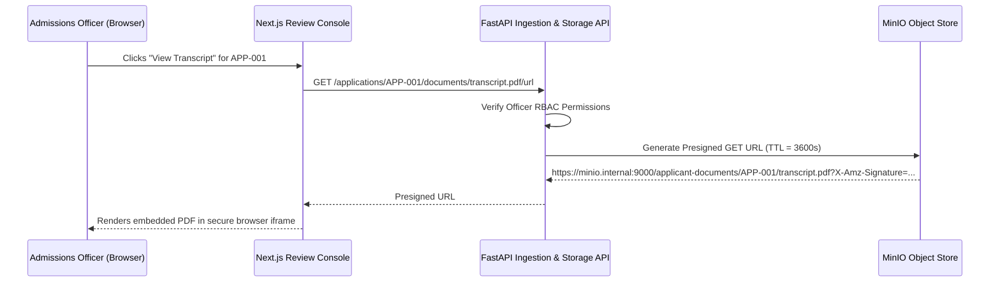

# MinIO Object Storage & Archival Architecture

**Component**: Relational Store + Review Queue (Object Archival)  
**Protocol**: S3-Compatible REST API  
**Implementation**: [`storage/minio_client.py`](../../storage/minio_client.py)

---

## 1. Storage Architecture Overview

All original student submission documents (PDFs, scans, supplementary documents) are archived in a secure, containerized **MinIO S3-compatible object store**. 

MinIO satisfies the requirements of **Trust Boundary 2 (Internal Secure Environment)**:
* Original binaries remain immutable and isolated from direct public internet exposure.
* Documents are stored with their exact byte payloads, preserving registrar formatting, seals, and digital signatures.
* Web console users (Admissions Officers) retrieve documents via short-lived, cryptographically signed URLs.

---

## 2. Bucket Organization & Key Naming Conventions

### Default Bucket
* **Bucket Identifier**: `applicant-documents`
* **Access Policy**: Private (Direct public anonymous reads disabled)

### Object Key Hierarchy
Files are partitioned hierarchically by `applicant_id`:

```text
applicant-documents/
├── APP-001/
│   ├── activities_and_awards.pdf
│   ├── advanced_coursework_and_ap_scores.pdf
│   ├── application_form.pdf
│   ├── personal_statement.pdf
│   ├── recommendation_letter_1.pdf
│   ├── recommendation_letter_2.pdf
│   ├── standardized_test_score.pdf
│   ├── transcript.pdf
│   └── university_supplement.pdf
├── APP-002/
│   └── ...
└── APP-010/
    └── ...
```

* **Standard Key Format**: `{applicant_id}/{sanitized_filename}`
* **Storage Path Example**: `s3://applicant-documents/APP-001/transcript.pdf`

---

## 3. Presigned URL Access Protocol

Frontend applications (such as the Next.js Review Console) access documents using MinIO presigned GET URLs generated on-demand by the backend API:



### Security Parameters
* **Expiry TTL**: 3600 seconds (1 hour).
* **Allowed Operations**: `s3:GetObject` only.
* **Audit Logging**: Every presigned URL issuance is logged in the `audit_logs` table with the requesting officer's user ID.
