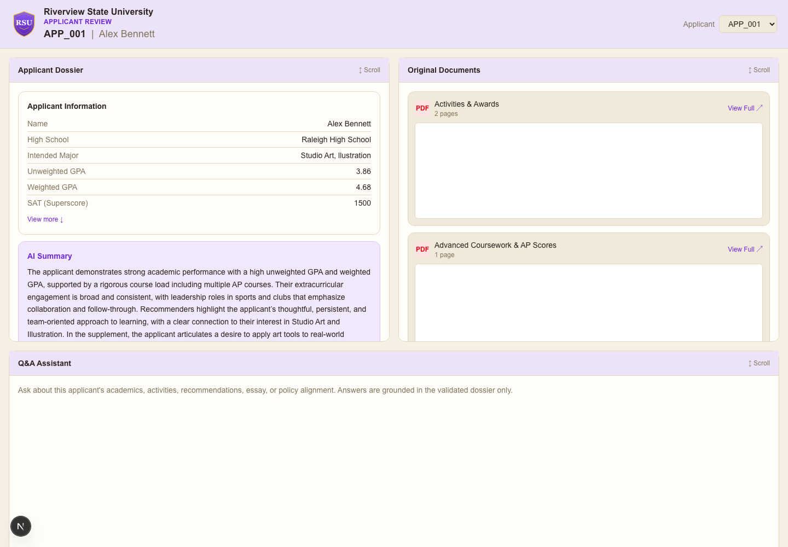

# Riverview State University — Applicant Review Chat

A Next.js UI for reviewing an applicant's AI-generated admissions dossier
and asking follow-up questions about it in a chat interface. The chatbot's
answers are grounded only in that applicant's dossier and will not make or
suggest an admission decision — see [How it works](#how-it-works) below.



This app reads **live** from the same PostgreSQL database and MinIO bucket
the Summarizing Agent pipeline writes to — the dossier comes from the
`applicant_dossier` / `dossier_generation_runs` tables, and every PDF in
the Original Documents panel is streamed live from MinIO by its stored
`object_key`. It never writes anything back to either — this is a
read-only review surface, not the officer decision tool (that's the
separate Streamlit app, `../app.py`).

---

## Contents

1. [What you need installed](#1-what-you-need-installed)
2. [One-time setup](#2-one-time-setup)
3. [Running it](#3-running-it)
4. [Using the app](#4-using-the-app)
5. [Testing with a different applicant](#5-testing-with-a-different-applicant)
6. [Troubleshooting](#6-troubleshooting)
7. [How it works](#how-it-works)

For a structured test checklist with pass/fail criteria (for the group to
run through and log results), see
[`../TESTING_GUIDE.md`](../TESTING_GUIDE.md) — it covers this app and the
Streamlit app together.

---

## 1. What you need installed

Everything the main pipeline needs, since this app reads from the same
services. Follow [`../README.md`](../README.md) section 3 ("One-time
setup") first if you haven't — it covers:

- **Node.js 20 or newer** — check with `node --version`.
- **Docker**, running the project's **PostgreSQL** container
  (`msa8770-postgres`).
- **MinIO**, installed via Homebrew.
- **Ollama**, with `qwen3-vl:8b-instruct` pulled (same model the
  Summarizing Agent uses).
- **At least one applicant with a generated dossier** — i.e. a row in the
  `applicant_dossier` table, produced by running `summarizing_agent.py`.
  This app doesn't generate dossiers, and it has no local-file fallback —
  if Postgres is empty or unreachable, there's nothing to show.

---

## 2. One-time setup

From the `chat-ui` folder, install dependencies:

```bash
cd rag_agent/chat-ui
npm install
```

Then copy the environment example and adjust only if your services run
somewhere other than `localhost` with the project's default
credentials:

```bash
cp .env.local.example .env.local
```

---

## 3. Running it

You need **Postgres, MinIO, and Ollama all running**, in addition to the
app itself.

**Start Postgres** (background container, skip if already running):
```bash
docker start msa8770-postgres
```

**Terminal 1 — MinIO** (serves the document previews):
```bash
cd rag_agent
MINIO_ROOT_USER=minioadmin MINIO_ROOT_PASSWORD=minioadmin \
  minio server ./minio-data --address :9000 --console-address :9001
```

**Terminal 2 — Ollama** (serves the Q&A chat):
```bash
ollama serve
```

**Terminal 3 — the chat app**:
```bash
cd rag_agent/chat-ui
npm run dev
```

Leave all three running. Then open your browser (this part trips people
up — make sure you type it into the browser's address bar at the very top
of the window, not a search box on a webpage):

```
http://localhost:3000
```

To stop any of them, go to its terminal and press `Ctrl+C` (for Postgres,
`docker stop msa8770-postgres`).

---

## 4. Using the app

1. In the top-right dropdown, pick an applicant (e.g. `APP_001`) — this
   list comes from `SELECT app_id FROM applicant_dossier`.
2. **Applicant Dossier** (left panel): applicant info, AI summary, a
   validation/policy snapshot, policy checks, and key evidence — each card
   scrolls independently, use "View more" / "View all" to expand the rest.
3. **Original Documents** (right panel): the applicant's actual source PDFs,
   streamed live from MinIO exactly as submitted — including the two
   documents withheld from the AI (Common App, personal statement),
   clearly labeled "Withheld from AI" with the reason. Click
   "View Full ↗" to open any document in a new tab.
4. **Q&A Assistant** (bottom panel): type a question about the applicant
   (e.g. *"What did the recommendation letters say about leadership?"*) and
   hit Enter or click Send. Answers cite the source document and page when
   possible. Switching applicants clears the conversation.

---

## 5. Testing with a different applicant

Run the Summarizing Agent against a new applicant ID (it writes directly
to `applicant_dossier` in Postgres — see the main README section 5.3).
Once that succeeds, refresh the browser tab — the new applicant appears in
the dropdown automatically, no restart needed.

If the applicant's source PDFs aren't in MinIO yet, run
`python setup/1_create_simulated_minio.py` (or however your group is
seeding new applicants' documents) first, or the Documents panel will list
the applicant but "View Full" will fail for their files.

---

## 6. Troubleshooting

**"Could not reach Ollama at http://localhost:11434/api/chat"**
Ollama isn't running, or the model isn't pulled. Run `ollama serve` in a
terminal and leave it open, and confirm the model is installed with
`ollama list` (you should see `qwen3-vl:8b-instruct`).

**Applicant dropdown is empty, or "No dossier found for applicant ..."**
Postgres is unreachable, or `applicant_dossier` has no rows. Check
`docker ps` shows `msa8770-postgres` as `Up`, and that the Summarizing
Agent has successfully run for at least one applicant
(`run_status = DOSSIER_READY`).

**"Could not fetch ... from MinIO bucket ..." when clicking View Full**
MinIO isn't running, or that object was never uploaded. Make sure the
`minio server ...` command is running, and that
`setup/1_create_simulated_minio.py` has been run for that applicant.

**The PDF preview boxes look blank**
Some browser setups don't render embedded PDFs inline. Click "View Full ↗"
to open the document directly — the file itself is fine either way.

**"This site can't be reached" in the browser**
Make sure `npm run dev` is still running in its terminal (closing the
terminal stops the server). Also confirm you typed `http://localhost:3000`
into the browser's address bar, not a Google search box.

**Port 3000 is already in use**
Something else is using that port. Either stop it, or run on a different
port:
```bash
npm run dev -- --port 3001
```
(then open `http://localhost:3001` instead).

**Chat answers are slow**
This runs the same local 8B model as the Python pipeline, on your own
machine — a single answer can take 20–40+ seconds depending on your
hardware. That's expected, not a bug.

---

## How it works

- `src/lib/dossier.ts` — holds the Postgres connection pool and MinIO
  client. `listApplicants`/`loadDossier` query `applicant_dossier` and the
  latest matching `dossier_generation_runs` row; `listOriginalDocuments`
  and `getDocumentObjectKey` read the document list from
  `simulated_applicant_data.documents` (JSONB).
- `src/app/api/applicants` — lists available applicants for the dropdown
  (from Postgres).
- `src/app/api/dossier` — returns one applicant's full dossier + document
  list (from Postgres).
- `src/app/api/documents` — streams the actual PDF bytes live from MinIO
  (`getObject`), after validating the filename belongs to that applicant.
- `src/app/api/chat` — builds a system prompt from that applicant's dossier
  (summary, strengths, policy assessment, evidence citations), sends it plus
  the conversation to Ollama (`qwen3-vl:8b-instruct` by default), and
  returns the reply. The prompt explicitly instructs the model to answer
  only from the dossier and never state or imply an admission decision,
  matching the same rule the Summarizing Agent itself follows.
- `src/components/` — one component per panel/card (`AppHeader`, `Logo`,
  `DossierPanel` and its cards, `DocumentsPanel`, `ChatPanel`). Colors and
  fonts live as CSS custom properties in `src/app/globals.css`, so the
  Riverview purple/beige theme can be retouched in one place.

Connection settings (`POSTGRES_*`, `MINIO_*`, `OLLAMA_*`) all live in
`.env.local` — see `.env.local.example` for the full list and defaults,
which match the main pipeline's own defaults exactly.
